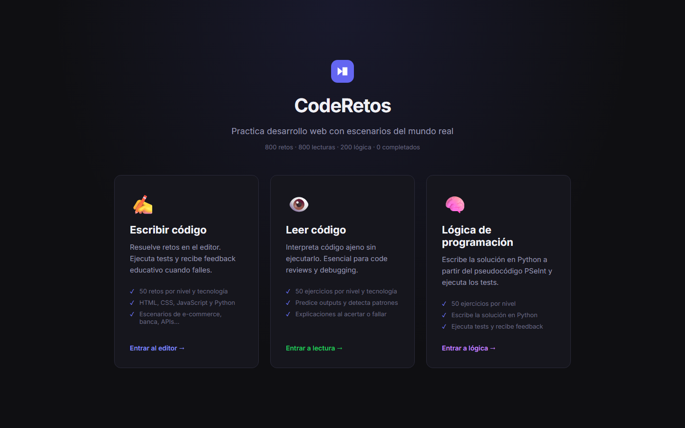
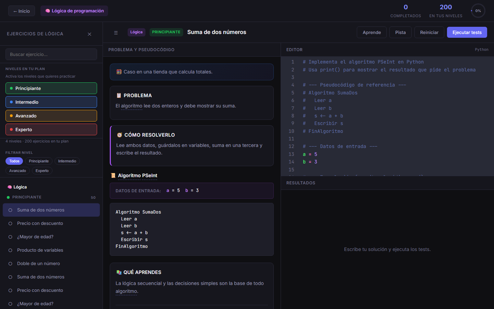

# CodeRetos

Plataforma web para practicar desarrollo web y lógica de programación con escenarios del mundo real, feedback educativo y progreso por niveles.

## Contenido

| Modo | Descripción | Cantidad |
|------|-------------|----------|
| **Escribir código** | Retos con editor, tests automáticos y vista previa (HTML/CSS) | 800 retos |
| **Leer código** | Predice outputs sin ejecutar — ideal para code review | 800 ejercicios |
| **Lógica de programación** | Pseudocódigo PSeInt → Python ejecutable con tests | 200 ejercicios |

**Tecnologías:** HTML, CSS, JavaScript, Python  
**Niveles:** Principiante, Intermedio, Avanzado, Experto (50 ejercicios por nivel y área)

## Características

- Selección por **niveles en tu plan** (no reto por reto)
- Glosario contextual con definiciones al hacer clic
- Autocompletado en el editor (Tab): etiquetas HTML, keywords, propiedades CSS
- Ejecución de JavaScript y Python en el navegador (Pyodide)
- Contenido educativo: qué aprendes, explicación, pistas y feedback al fallar

## Inicio local

Requisitos: **Python 3** (para el servidor estático) y un navegador moderno.

```powershell
git clone https://github.com/bryan4k/retos.git
cd retos
.\start.ps1
```

Abre [http://localhost:5500](http://localhost:5500)

> Si no tienes el script, también funciona: `python -m http.server 5500`

## Estructura del proyecto

```
retos/
├── index.html              # Shell principal (inicio + 3 apps)
├── styles.css              # Estilos globales
├── app.js                  # Lógica UI: práctica, lectura y lógica
├── technologies.js         # Tecnologías y niveles
├── challenges.js           # Ensambla retos y estadísticas
├── challenge-generator.js  # Generador de retos de escritura
├── reading-generator.js    # Generador de ejercicios de lectura
├── logic-generator.js      # Generador de lógica PSeInt
├── logic-runner.js         # Ejecuta y valida soluciones Python
├── runners.js              # Tests JS/HTML/CSS/Python
├── learn-content.js        # Contenido educativo por reto
├── glossary.js             # Glosario contextual
├── editor-hints.js         # Autocompletado CodeMirror
├── challenges-html.js      # Retos handcrafted HTML
├── challenges-css.js
├── challenges-javascript.js
├── challenges-python.js
└── start.ps1               # Servidor local puerto 5500
```

## Capturas

Puedes añadir imágenes en una carpeta `docs/` y referenciarlas aquí:

```markdown



```

## Despliegue

### GitHub Pages (recomendado)

El proyecto es 100 % estático; no necesita backend.

1. En GitHub: **Settings → Pages**
2. **Source:** Deploy from branch
3. **Branch:** `main` → carpeta `/ (root)`
4. Guarda y espera unos minutos
5. Tu sitio quedará en: `https://bryan4k.github.io/retos/`

### Netlify / Vercel

- **Build command:** (vacío)
- **Publish directory:** `.` (raíz del repo)
- No requiere variables de entorno

### Notas de producción

- Pyodide (Python en el navegador) carga desde CDN la primera vez; hace falta conexión a internet
- CodeMirror y fuentes también usan CDN (cdnjs, Google Fonts)

## Contribuir

1. Fork del repositorio
2. Crea una rama: `git checkout -b feature/mi-mejora`
3. Commit: `git commit -m "Describe el cambio"`
4. Push y abre un Pull Request

## Licencia

Proyecto educativo abierto. Úsalo y adapta libremente para aprender o enseñar.